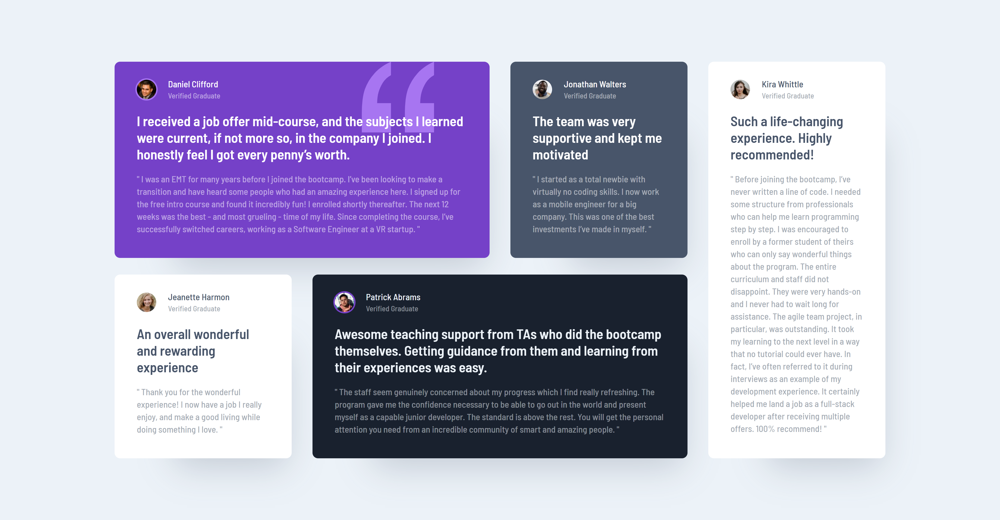

# Frontend Mentor - Testimonials grid section solution

This is a solution to the [Testimonials grid section challenge on Frontend Mentor](https://www.frontendmentor.io/challenges/testimonials-grid-section-Nnw6J7Un7). Frontend Mentor challenges help you improve your coding skills by building realistic projects. 

## Table of contents

- [Overview](#overview)
  - [The challenge](#the-challenge)
  - [Screenshots](#screenshots)
  - [Links](#links)
- [My process](#my-process)
  - [Built with](#built-with)
  - [What I learned](#what-i-learned)
  - [Useful resources](#useful-resources)

## Overview

### The challenge

Users should be able to:

- View the optimal layout for the site depending on their device's screen size

### Screenshots

Desktop:



Mobile:


### Links

- Live site: <https://michahuhn.github.io/frontendmentor-testimonials-grid-section>
- Challenge solution: <https://www.frontendmentor.io/solutions/testimonials-grid-section-using-vue-96T9IInqUi>

## My process

### Built with

- Vue
- SCSS
- CSS custom properties
- CSS Grid
- Semantic HTML5 markup
- Mobile-first workflow

### What I learned

I learned how to create a responsive CSS Grid layout including grid items which are spanning across multiple rows and columns.

I'm using `grid-template-areas` in this case:

```css
.testimonial-list {
  grid-template-areas:
    'one one two five'
    'three four four five';
}
```

### Useful resources

- [Get your stylesheets more organized with Sass partials - YouTube](https://www.youtube.com/watch?v=9Ld-aOKsEDk) - My SCSS folder structure is inspired by this video.
